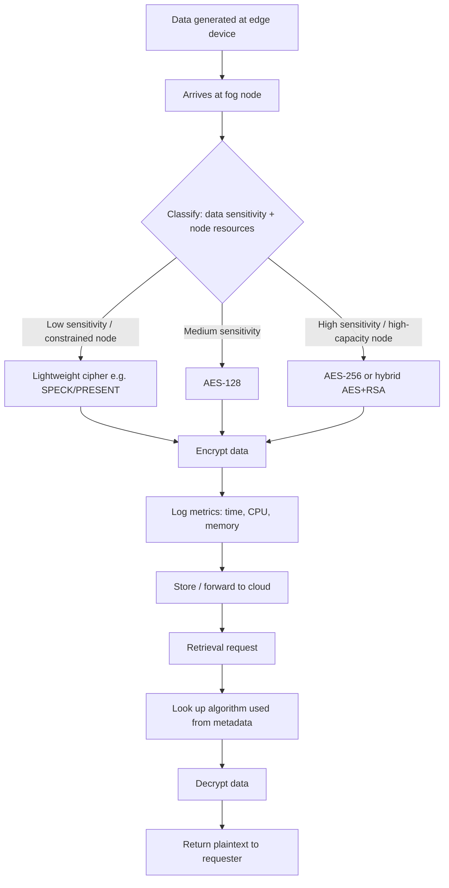

# Adaptive Encryption System for Fog Computing — Build Plan

**Objective (i):** Design and implement a secure and efficient encryption system for protecting data in a fog computing environment using adaptive encryption techniques.

---

## 1. Architecture Overview

Three simulated layers:

- **Edge layer** — simulated IoT devices generating data with a sensitivity label (low/medium/high) and size.
- **Fog layer** — several simulated fog nodes, each with a resource profile (CPU/battery/bandwidth level: constrained vs. high-capacity). This is where the adaptive logic lives.
- **Cloud layer** — final store for encrypted data.

The core idea: instead of encrypting everything with one fixed algorithm, each fog node looks at *how sensitive the data is* and *how much compute it has available*, then picks the encryption method that balances security against efficiency.

---

## 2. Core Components

1. **Node & Data Simulator** — generates fog nodes with different resource profiles, and data packets with sensitivity + size.
2. **Classifier / Context Assessor** — tags incoming data with sensitivity level; reads the current node's resource state.
3. **Adaptive Policy Engine** — the actual "adaptive" core. A rule table mapping `(sensitivity, resource_level) → algorithm`. A simple decision table is enough — no need for machine learning here, and it's easier to explain in a viva.
4. **Encryption/Decryption Engine** — wraps standard crypto libraries behind one common interface (`encrypt(data, algorithm)`, `decrypt(data, algorithm)`), so swapping algorithms is transparent to the caller.
5. **Key Manager** — generates/stores keys per algorithm and session. In-memory or simple file-based store is fine for a project of this scope — no need for a full KMS.
6. **Metrics/Benchmark Logger** — records encryption/decryption time, CPU/memory use, and throughput per algorithm and data size. This is the data that backs up the "secure and efficient" claim.
7. **Demo Dashboard** (recommended for the defense) — a small UI showing simulated nodes, live data flow, which algorithm got picked and why, plus charts comparing algorithm performance.

---

## 3. Recommended Stack

- **Core logic/crypto:** Python + `cryptography` or `PyCryptodome` (AES, RSA out of the box)
- **Simulating multiple nodes:** Python `multiprocessing` or a simple async loop — real distributed infra/Docker isn't necessary unless a more elaborate demo is wanted
- **Benchmarking:** `time` + `psutil` for CPU/memory; export results as JSON/CSV
- **Dashboard:** Next.js/React frontend + a small FastAPI/Flask backend serving simulation results, Recharts for the performance graphs
- **Storage:** SQLite or plain JSON files — no production DB needed for a demo

---

## 4. Build Phases (~2–3 weeks)

| Phase | Days | Work |
|---|---|---|
| 1 | 1–3 | Node/data simulator, classifier logic, policy engine (rule table) |
| 2 | 4–7 | Wire in AES/RSA (+ optional lightweight cipher), build metrics logger, run initial benchmarks |
| 3 | 8–12 | Build dashboard to visualize nodes/data flow/algorithm choice/benchmark charts, polish for presentation |
| 4 | 13–15 | Finalize flowchart, short design write-up, package code, final testing |

---

## 5. Deliverables Checklist

- [ ] System design write-up (architecture + rationale)
- [ ] Flowchart (finalized version of the diagram above)
- [ ] Working code: simulator, policy engine, encryption engine, key manager, benchmark logger
- [ ] Demo dashboard
- [ ] Benchmark results (charts/tables comparing algorithms across data sizes)

---

## 6. Testing & Benchmarking Plan

- **Efficiency:** measure encryption/decryption time and memory use across algorithms at a few data sizes (e.g. 1KB, 100KB, 1MB). Show the adaptive approach picks lighter algorithms for constrained scenarios, and quantify the time/resource savings versus always using the heaviest algorithm.
- **Security:** for a project at this level, security is usually argued qualitatively — cite the known strength of the chosen algorithms (AES-256, RSA-2048, etc.) for the high-sensitivity cases rather than attempting new cryptanalysis.

---

## Notes

- Don't hand-roll ciphers — use established libraries. What's being evaluated is the system design and the adaptive decision logic, not new cryptography.
- If more objectives turn up beyond this one, treat them as separate scope/build plans rather than folding them into this one.
