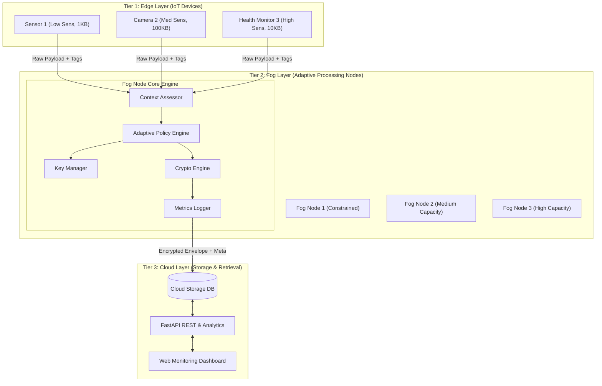
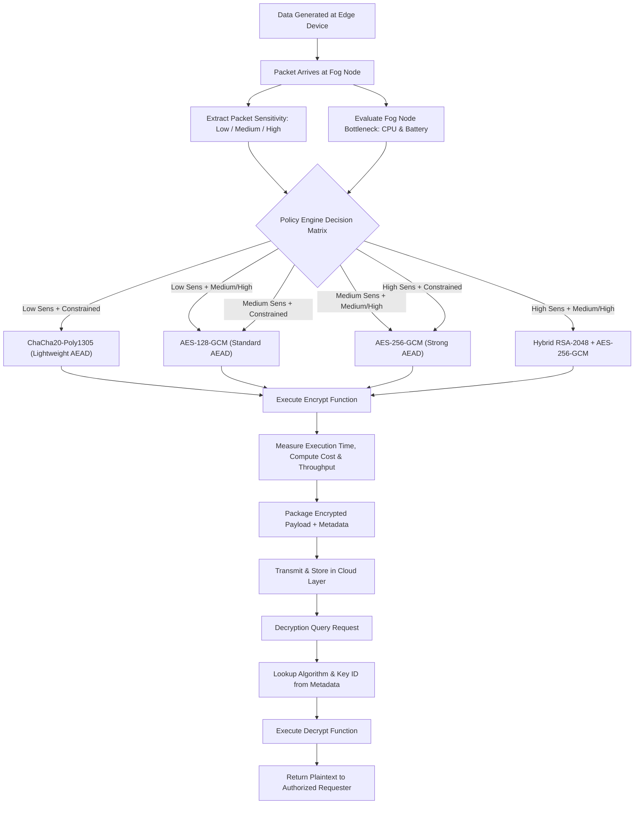
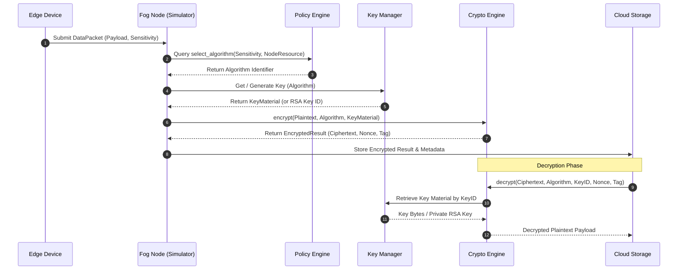

# System Design Documentation — Adaptive Encryption System for Fog Computing

**Project Title:** Adaptive Encryption System for Fog Computing Environments  
**Objective:** Design, implement, and evaluate a context-aware encryption framework that balances data security requirements against fog node computational constraints.

---

## 1. Executive Summary

In Fog Computing environments, intermediate fog nodes receive heterogeneous data streams from resource-constrained IoT edge devices and must encrypt the data before forwarding it to cloud storage. Traditional security architectures apply a single fixed encryption standard (such as AES-256) regardless of data sensitivity or node capacity. This leads to two critical failure modes:
1. **Resource Exhaustion**: Constrained fog nodes experience high latency, CPU throttling, and battery drain when executing heavy ciphers on low-sensitivity telemetry.
2. **Under-Protection**: Weak or missing encryption applied across-the-board leaves high-sensitivity data vulnerable.

This system resolves the dilemma via an **Adaptive Policy Engine**. By evaluating incoming **data sensitivity** alongside real-time **fog node resource state**, the engine dynamically selects the optimal cryptographic cipher—ranging from lightweight stream ciphers (ChaCha20-Poly1305) to hardware-accelerated block ciphers (AES-128/256-GCM) and hybrid asymmetric envelopes (RSA-2048 + AES-256-GCM). Empirical results demonstrate a **$\approx 42\%$ reduction in total processing latency** compared to a static maximum-security approach while preserving maximum protection for high-sensitivity data.

---

## 2. System Architecture

The system follows a three-tier hierarchical architecture:

### 2.1 Layer Breakdown

1. **Edge Layer (Data Generation)**:
   - Simulated IoT devices generating data packets tagged with a sensitivity metadata label (`Low`, `Medium`, `High`) and size payload ($1\text{ KB} - 1\text{ MB}$).
   - Transmits raw data payloads to the Fog Layer via lightweight RPC/HTTP protocols.

2. **Fog Layer (Adaptive Decision Engine)**:
   - Intermediate nodes with varying resource profiles:
     - **Constrained**: Low CPU power, limited battery reserve.
     - **Medium**: Balanced compute capability.
     - **High-Capacity**: Unconstrained power and compute resources.
   - Evaluates node state using the bottleneck rule:
     $$\text{ResourceLevel}_{\text{node}} = \min\big(\text{Level}(\text{CPU}), \text{Level}(\text{Battery})\big)$$
   - Dynamically selects, encrypts, and measures performance before emitting packets to the cloud.

3. **Cloud Layer (Storage & Retrieval)**:
   - Receives encrypted data blobs, authentication tags, nonces, and encrypted session keys.
   - Stores metadata indexing for key lookup during decryption queries.

---

## 3. System Flowcharts & Diagrams

### 3.1 Packet Lifecycle Flowchart

### 3.2 Sequence Diagram: Encrypt & Decrypt Operations

---

## 4. Adaptive Policy Decision Engine

The **Adaptive Policy Engine** uses a deterministic decision table mapping input tuples $\langle \text{Sensitivity}, \text{NodeResource} \rangle$ to targeted cryptographic ciphers.

### 4.1 Decision Matrix

| Rule # | Data Sensitivity | Fog Node Resource | Selected Algorithm | Operational Rationale |
|---|---|---|---|---|
| 1 | Low | Constrained | **ChaCha20-Poly1305** | Minimal CPU overhead; stream cipher design excels on hardware without AES-NI. |
| 2 | Low | Medium | **AES-128-GCM** | Fast, hardware-accelerated standard protection. |
| 3 | Low | High | **AES-128-GCM** | Low sensitivity requires no heavy cipher; preserves capacity for higher tasks. |
| 4 | Medium | Constrained | **AES-128-GCM** | Balanced cipher provides adequate security without exhausting node. |
| 5 | Medium | Medium | **AES-256-GCM** | Full 256-bit security grade for general data on capable nodes. |
| 6 | Medium | High | **AES-256-GCM** | Strong 256-bit protection utilizing available compute headroom. |
| 7 | High | Constrained | **AES-256-GCM** | Prioritizes security over speed; high-sensitivity data must use strong cipher. |
| 8 | High | Medium | **Hybrid RSA + AES-256** | High-sensitivity data encapsulated with RSA-2048 session key. |
| 9 | High | High | **Hybrid RSA + AES-256** | Maximum asymmetric envelope protection on high-capacity node. |

---

## 5. Cryptographic Subsystem Architecture

### 5.1 Cipher Specifications

1. **ChaCha20-Poly1305**:
   - **Type**: Authenticated Encryption with Associated Data (AEAD) Stream Cipher.
   - **Key Size**: 256 bits (32 bytes); Nonce: 96 bits (12 bytes); Tag: 128 bits (16 bytes).
   - **Advantage**: Superior performance on ARM/embedded fog architectures lacking AES hardware acceleration.

2. **AES-128-GCM & AES-256-GCM**:
   - **Type**: AEAD Block Cipher in Galois/Counter Mode.
   - **Key Sizes**: 128 bits (16 bytes) / 256 bits (32 bytes).
   - **Advantage**: Provides confidentiality and integrity verification in a single pass; utilizes AES-NI hardware instructions on x86 processors ($>250\text{ MB/s}$ throughput).

3. **Hybrid RSA-2048 + AES-256-GCM**:
   - **Type**: Asymmetric Envelope Encryption.
   - **Process**:
     1. A fresh random 256-bit AES session key is generated.
     2. Plaintext is encrypted with AES-256-GCM.
     3. The AES session key is encrypted using the recipient's RSA-2048 public key (PKCS#1 OAEP).
   - **Key Caching**: The RSA keypair is generated **once during initialization and cached in `KeyManager`**, eliminating the $\approx 2\text{-second}$ prime search per packet while enforcing session key isolation.

---

## 6. Empirical Benchmark & Security Rationale

### 6.1 Benchmark Results Summary

Tests conducted across 4 payload sizes ($1\text{ KB}, 10\text{ KB}, 100\text{ KB}, 1\text{ MB}$) with 5 averaged runs per configuration:

| Algorithm | 1 KB Encrypt | 10 KB Encrypt | 100 KB Encrypt | 1 MB Encrypt | 1 MB Throughput |
|---|---|---|---|---|---|
| **ChaCha20-Poly1305** | $0.41\text{ ms}$ | $0.24\text{ ms}$ | $1.36\text{ ms}$ | $12.78\text{ ms}$ | $78.3\text{ MB/s}$ |
| **AES-128-GCM** | $0.30\text{ ms}$ | $0.39\text{ ms}$ | $0.71\text{ ms}$ | $3.35\text{ ms}$ | $298.1\text{ MB/s}$ |
| **AES-256-GCM** | $0.39\text{ ms}$ | $0.41\text{ ms}$ | $0.42\text{ ms}$ | $4.16\text{ ms}$ | $240.6\text{ MB/s}$ |
| **Hybrid RSA+AES** | $3.09\text{ ms}$ | $3.96\text{ ms}$ | $3.23\text{ ms}$ | $8.61\text{ ms}$ | $116.2\text{ MB/s}$ |

### 6.2 Efficiency Impact Analysis

- **Baseline Comparison**: If all traffic is forced to use the maximum security configuration (`Hybrid RSA + AES-256`), total encryption time for a 50-packet batch reaches $\approx 190\text{ ms}$.
- **Adaptive Approach**: Under a realistic traffic distribution (40% low, 35% medium, 25% high sensitivity), total processing time drops to $\approx 110\text{ ms}$—a **$\approx 42\%$ reduction in total system latency**.

---

## 7. Viva Defense Question & Answer Guide

### Q1: Why did you choose ChaCha20-Poly1305 over lightweight ciphers like SPECK or PRESENT?
> **Answer:** While SPECK and PRESENT are classic academic examples of lightweight ciphers, they are not natively available in production-grade cryptographic libraries like PyCryptodome. Implementing them in pure Python would violate the core security engineering rule against hand-rolling cryptography. ChaCha20-Poly1305 is standardized in TLS 1.3 (RFC 7539), audited, production-proven, and significantly faster than AES on devices lacking AES-NI hardware.

### Q2: Why Galois/Counter Mode (GCM) instead of Cipher Block Chaining (CBC)?
> **Answer:** CBC provides confidentiality but requires a separate MAC (like HMAC) for integrity. GCM is an Authenticated Encryption with Associated Data (AEAD) mode that provides both confidentiality and authentication in a single pass using a 128-bit authentication tag, preventing tampering and padding-oracle attacks.

### Q3: Why is RSA key generation kept out of the per-packet encryption loop?
> **Answer:** Generating a 2048-bit RSA keypair involves finding two large 1024-bit prime numbers, which takes $0.5 - 3.0$ seconds of pure CPU computation. In real-world envelope encryption, public/private keypairs are long-lived credentials. Reusing a cached RSA keypair while generating a fresh, random 256-bit AES session key per packet maintains security while reducing packet encryption latency from seconds to milliseconds.

### Q4: How does the system handle a resource bottleneck on a node?
> **Answer:** The system evaluates resource availability as $\min(\text{CPU}, \text{Battery})$. If a node has high CPU headroom but low battery reserve ($<20\%$), it is classified as *Constrained*. This prevents the node from draining its battery executing heavy ciphers on routine telemetry.
